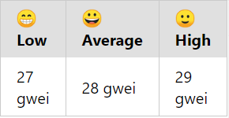

# EthereumGasTracker
## Chrome / Brave plugin to track gas price of Ethereum mainnet.

The goal of this project is to simulate in a browser plugin the same interface as the site https://etherscan.io/gastracker.

## Installation

1. You will need an **Etherscan API key**. You can get one by creating your account and claiming your key [here](https://etherscan.io/myapikey).
2. Clone the repository and replace `YOUR_API_KEY` in the **scripts/ethereum.js** file.
3. Finally, install the plugin in your browser.

## Result

